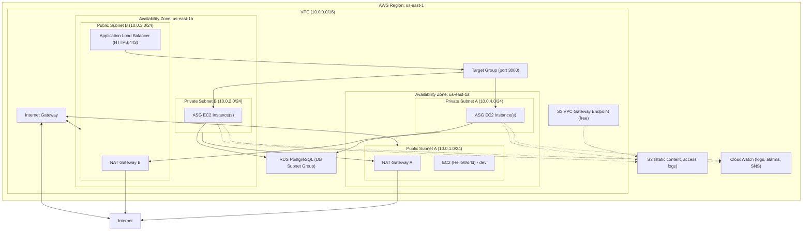

# AWS Web Application – Architecture Diagram

**Region:** `us-east-1`  
**VPC:** `terraform-aws-webapp-setup-vpc` (10.0.0.0/16)  
**Last updated:** March 8, 2026

---

## Mermaid diagram (use in GitHub, VS Code, or [mermaid.live](https://mermaid.live))



---

## ASCII diagram

```
                    ┌─────────────────────────────────────────────────────────────────────────────┐
                    │                        AWS Region: us-east-1                                 │
                    └─────────────────────────────────────────────────────────────────────────────┘
                                                      │
                    ┌─────────────────────────────────▼─────────────────────────────────┐
                    │                    VPC (10.0.0.0/16)                               │
                    │              terraform-aws-webapp-setup-vpc                        │
                    │                                                                   │
                    │  ┌──────────────────────── Internet Gateway ──────────────────────┐│
                    │  │                              │                                 ││
    Internet ────────┼──┼──────────────────────────────┼─────────────────────────────────┼────────
                    │  │                              │                                 ││
                    │  │  ┌──────────────────────────┴──────────────────────────┐      ││
                    │  │  │     PUBLIC SUBNETS (route: 0.0.0.0/0 → IGW)          │      ││
                    │  │  │  us-east-1a: 10.0.1.0/24   │   us-east-1b: 10.0.3.0/24 │      ││
                    │  │  │  ┌──────────────────┐      │      ┌──────────────────┐ │      ││
                    │  │  │  │ NAT Gateway A     │      │      │ NAT Gateway B     │ │      ││
                    │  │  │  │ (EIP)             │      │      │ (EIP)             │ │      ││
                    │  │  │  └────────┬─────────┘      │      └────────┬─────────┘ │      ││
                    │  │  │  ┌──────────────────┐      │      ┌──────────────────┐ │      ││
                    │  │  │  │ EC2 (HelloWorld)  │      │      │ ALB (HTTPS:443)   │ │      ││
                    │  │  │  │ dev/testing      │      │      │ ALB-SG            │ │      ││
                    │  │  │  └──────────────────┘      │      └────────┬─────────┘ │      ││
                    │  │  └────────────────────────────┼───────────────┼───────────┘      ││
                    │  │                               │               │                  ││
                    │  │  ┌───────────────────────────▼───────────────▼───────────┐      ││
                    │  │  │     PRIVATE SUBNETS (per-AZ NAT, S3 via Gateway EP)    │      ││
                    │  │  │  us-east-1a: 10.0.4.0/24 → NAT B  │  us-east-1b: 10.0.2.0/24 → NAT A │
                    │  │  │  ┌──────────────────┐            │  ┌──────────────────┐     │      ││
                    │  │  │  │ ASG (EC2)        │◄───────────┼──│ ASG (EC2)        │     │      ││
                    │  │  │  │ Node.js / PM2    │  Target    │  │ Node.js / PM2    │     │      ││
                    │  │  │  └────────┬─────────┘  Group     │  └────────┬─────────┘     │      ││
                    │  │  │           │           :3000     │           │               │      ││
                    │  │  │           └───────────┬──────────┘           │               │      ││
                    │  │  │                       ▼                      │               │      ││
                    │  │  │  ┌─────────────────────────────────────────────────────────┐  │      ││
                    │  │  │  │  DB Subnet Group  │  RDS PostgreSQL (Multi-AZ optional)  │  │      ││
                    │  │  │  └─────────────────────────────────────────────────────────┘  │      ││
                    │  │  └─────────────────────────────────────────────────────────────┘      ││
                    │  │                                                                       ││
                    │  │  S3 VPC Gateway Endpoint (com.amazonaws.us-east-1.s3)                  ││
                    │  │  → Public RT, Private RT A, Private RT B (S3 traffic bypasses NAT)      ││
                    │  └───────────────────────────────────────────────────────────────────────┘
                    └───────────────────────────────────────────────────────────────────────────┘
                    
                    External:  S3 (static content, access logs)   CloudWatch (logs, alarms, SNS)
```

---

## Component summary

| Component               | Resource / name                         | Location / details                                      |
|-------------------------|----------------------------------------|--------------------------------------------------------|
| **Region**              | us-east-1                               | N. Virginia                                            |
| **VPC**                 | main-webapp                             | 10.0.0.0/16, DNS hostnames/support on                  |
| **Internet Gateway**    | main                                    | Attached to VPC; public subnets route 0.0.0.0/0 → IGW  |
| **NAT Gateway A**       | main_a                                  | Public Subnet A (us-east-1a), EIP nat_a                |
| **NAT Gateway B**       | main_b                                  | Public Subnet B (us-east-1b), EIP nat_b                |
| **Public Subnet A**     | Publicsubnet                            | 10.0.1.0/24, us-east-1a                                |
| **Public Subnet B**     | Publicsubnet_b                          | 10.0.3.0/24, us-east-1b                                |
| **Private Subnet A**    | Privatesubnet_b                         | 10.0.4.0/24, us-east-1a, routes via NAT B               |
| **Private Subnet B**    | Privatesubnet                           | 10.0.2.0/24, us-east-1b, routes via NAT A               |
| **Private Route Table A** | PrivateRouteTable_A                   | Private Subnet B → NAT A                               |
| **Private Route Table B** | PrivateRouteTable_B                   | Private Subnet A → NAT B                               |
| **S3 VPC Endpoint**     | Gateway endpoint                        | S3 traffic via endpoint (no NAT cost); public + both private RTs |
| **ALB**                 | app                                     | Public subnets (both AZs), HTTPS:443, ALB-SG            |
| **Target Group**        | app                                     | Port 3000, /health check                                |
| **ASG**                 | app                                     | Private subnets, 1–2 EC2s, launch template              |
| **Standalone EC2**      | example (HelloWorld)                    | Public Subnet A, dev/testing                           |
| **RDS**                 | db (PostgreSQL)                         | DB subnet group (private subnets), db-sg                |
| **S3**                  | static_content, access_logs             | Regional; KMS encrypted, versioning on static          |
| **CloudWatch**          | Log groups, alarms, dashboard, SNS      | Regional                                               |

---

## Security groups

| SG           | Purpose                    | Key ingress                                      |
|--------------|----------------------------|--------------------------------------------------|
| **ALB-SG**   | Application Load Balancer  | HTTPS 443 from 0.0.0.0/0                        |
| **ec2**      | Standalone EC2 (dev)       | SSH, HTTP 80, HTTPS 443                          |
| **app_server** | App instances (ASG)     | From ALB-SG (port 3000), SSH from bastion       |
| **db**       | RDS PostgreSQL             | Port 5432 from app_server only                   |
| **bastion**  | SSH jump host              | SSH from laptop IP only                          |

---

*Generated from Terraform configuration. Reflects true project state as of March 8, 2026.*
